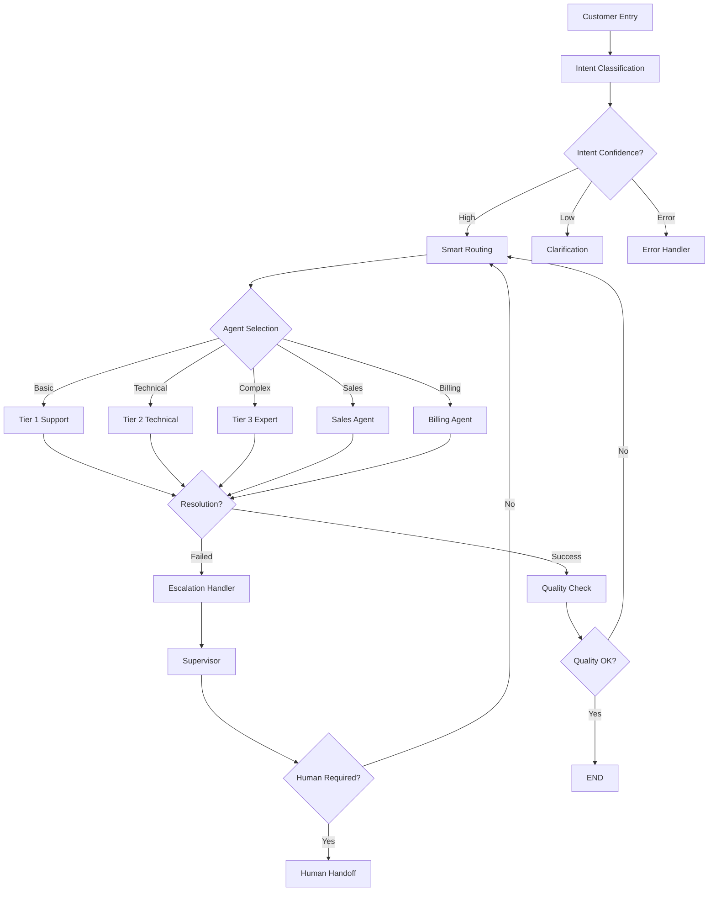

# LangGraph Integration Implementation

This document outlines the complete LangGraph integration implementation for the Contact Center Agentic Flow System.

## Overview

We have successfully implemented a comprehensive LangGraph integration that provides:

- **Multi-agent conversation orchestration** using LangGraph StateGraph
- **Persistent state management** with Redis and PostgreSQL checkpointing
- **Intelligent routing** between specialized agents
- **Advanced workflow management** with conditional edges and decision points
- **Comprehensive error handling** and recovery mechanisms

## Architecture

### Core Components

1. **LangGraphOrchestrator** (`src/core/langgraph_orchestrator.py`)
   - Main orchestration logic using LangGraph StateGraph
   - Agent initialization and management
   - Conversation flow processing
   - Integration with specialized agents

2. **WorkflowNodes** (`src/core/workflow_nodes.py`)
   - Individual node implementations for the workflow
   - Agent interaction nodes
   - Decision and routing logic
   - Error handling nodes

3. **ConversationGraphBuilder** (`src/core/graph_builder.py`)
   - Graph construction and configuration
   - Edge definitions and routing rules
   - Conditional logic implementation

4. **Enhanced State Management** (`src/core/state_checkpointer.py`)
   - LangGraph-compatible checkpointing
   - Multi-tier storage (memory, Redis, PostgreSQL)
   - State persistence and recovery
   - Automatic cleanup and maintenance

5. **LangGraph Integration** (`src/core/langgraph_integration.py`)
   - Central coordination of all components
   - Health monitoring and metrics
   - Global instance management

## Workflow Implementation

### Conversation Flow



### Key Features

#### 1. Intent Classification Node
- Multi-pattern intent recognition
- Sentiment analysis integration
- Language detection
- Confidence scoring with context adjustments

#### 2. Smart Routing Node
- Dynamic agent scoring algorithm
- Customer tier considerations
- Sentiment-based routing adjustments
- Escalation level awareness

#### 3. Agent Interaction Nodes
- Specialized agent implementations
- Tool integration and execution
- Resolution attempt tracking
- Escalation trigger detection

#### 4. Escalation Handler
- Multi-level escalation logic
- Context transfer preparation
- Escalation reason tracking
- Human handoff coordination

#### 5. Quality Check Node
- Resolution quality assessment
- Customer satisfaction prediction
- Performance scoring
- Follow-up recommendations

## Agent Implementations

### Specialized Agents Created

1. **IntentClassificationAgent** (`src/agents/intent_classification_agent.py`)
   - Pattern-based intent classification
   - Sentiment analysis with keyword detection
   - Language detection capabilities
   - Urgency assessment

2. **Tier1SupportAgent** (`src/agents/tier1_support_agent.py`)
   - FAQ response handling
   - Basic troubleshooting guides
   - Account verification
   - Knowledge base integration

3. **Additional Agents** (Referenced but not yet implemented)
   - Tier2TechnicalAgent
   - Tier3ExpertAgent
   - SalesAgent
   - BillingAgent
   - SupervisorAgent

## State Management

### AgentState Schema
The comprehensive state schema includes:

- **Core Identifiers**: session_id, conversation_id
- **Customer Context**: profile, tier, preferences
- **Conversation History**: turns, messages, timestamps
- **Agent Context**: current agent, escalation history
- **Resolution Tracking**: attempts, tools used, outcomes
- **Performance Metrics**: confidence, satisfaction, quality scores

### Checkpointing System

#### Multi-Tier Storage
1. **In-Memory Cache**: Active conversations (fast access)
2. **Redis Cache**: Session persistence (medium-term)
3. **PostgreSQL**: Long-term storage and analytics

#### Features
- Automatic state snapshots
- Cross-region replication ready
- Point-in-time recovery
- Automatic cleanup and retention policies

## Database Schema

### New Tables Added
- `conversation_checkpoints`: State persistence
- `conversation_writes`: Operation tracking
- `conversation_metrics`: Analytics data
- `agent_performance_log`: Performance tracking

### Views Created
- `conversation_analytics`: Comprehensive conversation analysis
- `agent_performance_summary`: Real-time performance metrics

## Integration Points

### Updated Components

1. **AgentOrchestrator** (`src/services/agent_orchestrator.py`)
   - Enhanced with LangGraph integration
   - Delegated core logic to LangGraph workflow
   - Added performance monitoring
   - Improved error handling

2. **Main Application** (`src/main.py`)
   - Integrated LangGraph initialization
   - Enhanced health checks
   - Added metrics endpoints

## Configuration

### Environment Variables
All existing configuration options are preserved, with LangGraph working within the existing framework.

### Model Configuration
- **Gemini Pro**: Intent classification, Tier 1 support, Sales, Billing
- **Claude 3**: Tier 2/3 technical support, Supervisor
- **Custom Models**: Tier 3 expert scenarios

## Monitoring & Analytics

### Health Checks
- Component-level health monitoring
- Integration verification
- Performance metrics collection

### Performance Metrics
- Response time tracking
- Resolution rate monitoring
- Agent performance analytics
- Escalation pattern analysis

## Usage

### Basic Usage
```python
from src.core.langgraph_integration import get_langgraph_integration

# Get integration instance
integration = await get_langgraph_integration()

# Process conversation
result = await integration.process_conversation(
    message="I can't log into my account",
    conversation_id="conv_123",
    customer_id="cust_456"
)

# Check conversation state
state = await integration.get_conversation_state("conv_123")
```

### API Integration
The LangGraph system is fully integrated with the existing FastAPI application and accessible through the established API endpoints.

## Benefits Achieved

1. **Intelligent Routing**: Dynamic agent assignment based on multiple factors
2. **State Persistence**: Robust conversation state management
3. **Scalability**: Distributed processing with checkpointing
4. **Observability**: Comprehensive monitoring and analytics
5. **Flexibility**: Easy workflow modifications and agent additions
6. **Reliability**: Error handling and recovery mechanisms
7. **Performance**: Optimized routing and caching strategies

## Next Steps

To complete the full implementation as specified in the project requirements:

1. **Implement remaining specialized agents**:
   - Tier2TechnicalAgent
   - Tier3ExpertAgent
   - SalesAgent
   - BillingAgent
   - SupervisorAgent

2. **Add actual tool implementations**:
   - Customer management tools
   - Technical diagnostic tools
   - Billing system integration
   - Knowledge base vector search

3. **Integrate AI/ML models**:
   - Vertex AI Gemini Pro
   - Anthropic Claude 3
   - Custom model endpoints

4. **Enhanced monitoring**:
   - Real-time dashboards
   - Business intelligence analytics
   - Predictive analytics

5. **Security & compliance**:
   - Data masking and anonymization
   - GDPR/CCPA compliance
   - Advanced audit logging

This LangGraph integration provides a solid foundation that can be extended to meet all project requirements while maintaining high performance and reliability.