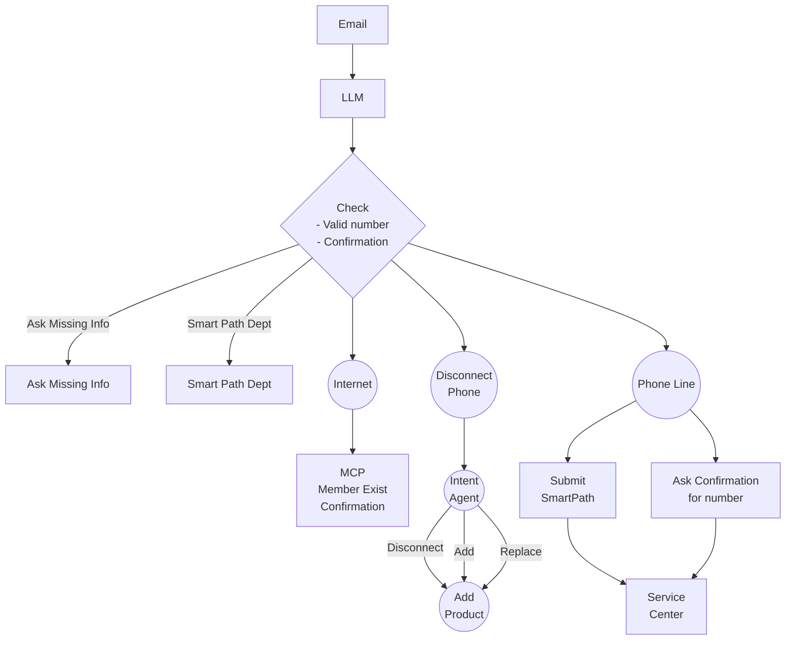

```mermaid
flowchart TD
    Email --> LLM
    LLM --> Check{Check<br/>- Valid number<br/>- Confirmation}
    
    Check --> |Ask Missing Info| MissingInfo[Ask Missing Info]
    Check --> |Smart Path Dept| SmartPath[Smart Path Dept]
    
    Check --> Internet((Internet))
    Check --> Disconnect((Disconnect<br/>Phone))
    Check --> PhoneLine((Phone Line))
    
    Internet --> MCP[MCP<br/>Member Exist<br/>Confirmation]
    PhoneLine --> AskConfirmation[Ask Confirmation<br/>for number]
    
    Disconnect --> IntentAgent((Intent<br/>Agent))
    IntentAgent --> |Disconnect| AddProduct((Add<br/>Product))
    IntentAgent --> |Add| AddProduct
    IntentAgent --> |Replace| AddProduct
    
    PhoneLine --> Submit[Submit<br/>SmartPath]
    Submit --> ServiceCenter[Service<br/>Center]
    
    AskConfirmation --> ServiceCenter
```