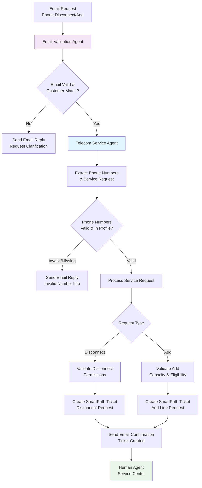

# Telecom Email Support Flow - Phone Number Management

## Agent Assignment

**Primary Agent**: `TelecomServiceAgent` (specialized customer service agent)

## Required Tools

1. **Email Validation Tools**
   - `validate_email_format`
   - `lookup_customer_by_email` 
   - `send_email_reply`

2. **Phone Number Management Tools**
   - `validate_phone_number`
   - `get_customer_phone_services`
   - `check_disconnect_eligibility`
   - `check_add_line_capacity`

3. **Ticketing System Tools**
   - `create_smartpath_ticket`
   - `add_ticket_notes`
   - `set_ticket_priority`

4. **Customer Profile Tools**
   - `get_customer_profile`
   - `update_customer_notes`
   - `log_customer_interaction`

## Workflow Steps

1. **Email Validation** - Verify sender email and match to customer profile
2. **Information Extraction** - Parse phone numbers and service request details
3. **Validation** - Confirm phone numbers exist in customer profile
4. **Service Processing** - Handle disconnect/add requests with business rules
5. **Ticket Creation** - Generate SmartPath tickets with detailed notes
6. **Email Response** - Send confirmation or clarification requests
7. **Human Handoff** - Queue for service center with complete context